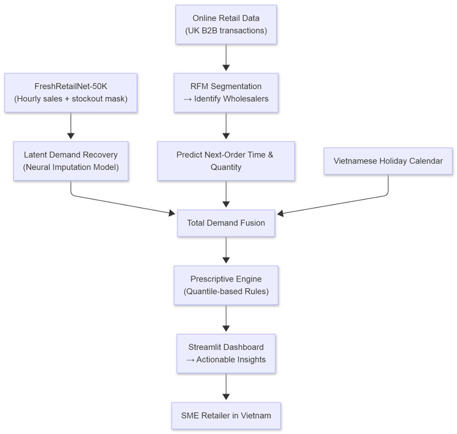
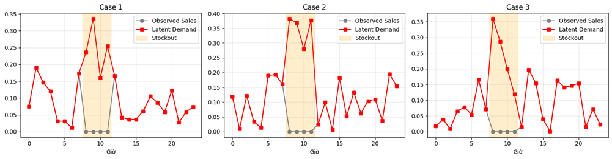
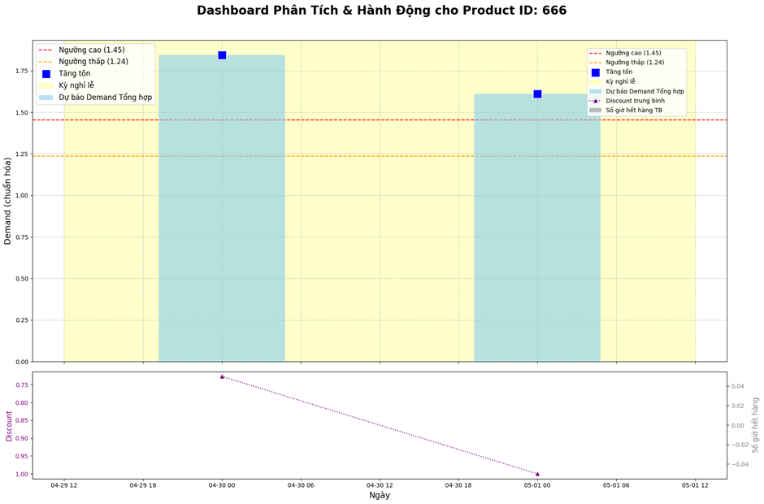
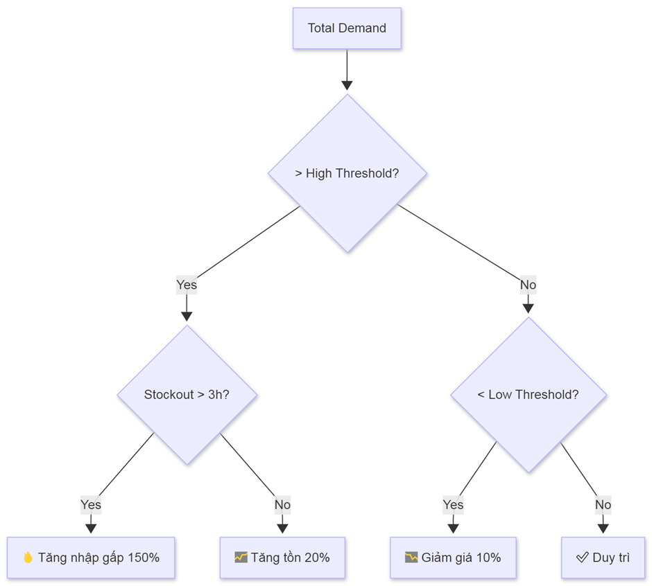
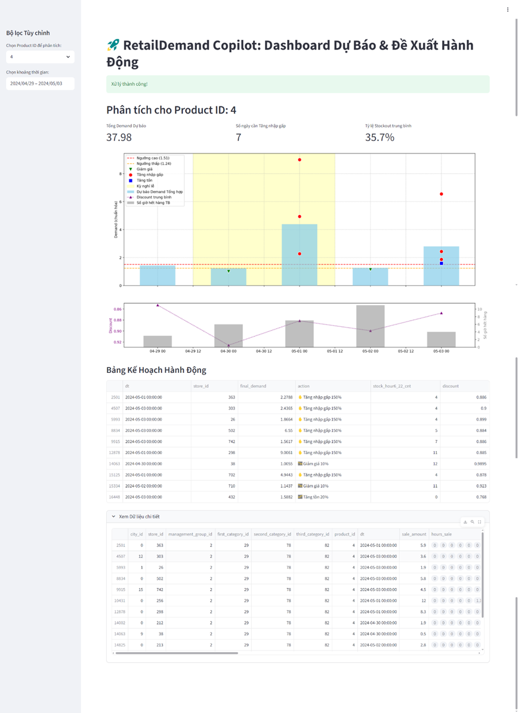

# RetailDemand Copilot

AI project for sale demand forecasting and prescriptive inventory actions, built from multiple real-world retail datasets.

This repository is prepared as a portfolio project for data science and machine learning job applications.

## 1. Project Overview

Retailers often under-estimate true demand when products are out of stock. This project solves that problem by combining:

- Predictive AI: recover latent demand from censored sales signals.
- Customer Behavior Analytics: estimate B2B wholesale reorder behavior.
- Prescriptive AI: recommend concrete actions such as restock, increase safety stock, or discount.

## 2. Business Goals

- Improve demand forecast quality under stockout conditions.
- Reduce lost sales and emergency stockouts.
- Support inventory decisions with explainable rules.
- Integrate holiday effects for Vietnam market context.

## 3. Datasets Used

Do not commit raw datasets to GitHub. Download from official sources below.

- FreshRetailNet-50K (main dataset, censored demand benchmark)
  - Hugging Face: https://huggingface.co/datasets/Dingdong-Inc/FreshRetailNet-50K
  - Paper: https://arxiv.org/abs/2505.16319
  - GitHub baseline: https://github.com/Dingdong-Inc/frn-50k-baseline
- Online Retail (UCI)
  - UCI page: https://archive.ics.uci.edu/dataset/352/online+retail
- Walmart Sales Forecast (optional benchmark and feature ideas)
  - Kaggle: https://www.kaggle.com/datasets/aslanahmedov/walmart-sales-forecast

## Demo and Assets

### YouTube Demo (Placeholder)

- Demo video: [RetailDemand Copilot | Dự báo nhu cầu bán lẻ + Prescriptive Engine](https://youtu.be/pHg7bgbfDEI)

### Report and Slides (Placeholders)

- Full report PDF: [Report link here](https://drive.google.com/file/d/1Erbkixa85-oAl6wC-McPuUcKH-QYClPe/view?usp=sharing)
- Slide deck PDF: [Slides link here](https://drive.google.com/file/d/1AGshNYys_b0IybGVds5OlP_6HM7XOG7B/view?usp=sharing)

### Project Architecture



### Latent Demand Recovery Examples



### Holiday + Prescriptive Logic





### Streamlit Dashboard Preview



## 4. Repository Structure

```text
datastorm_round_1/
├── FreshRetailNet-50K-Dataset/
│   ├── 01_EDA_FreshRetailNet50K.ipynb
│   ├── 02_Train_Latent_Demand_Model.ipynb
│   ├── 03_Eval_Predict_and_Visualize.ipynb
│   ├── 04_Prescriptive_Engine.ipynb
│   ├── data/                       # local only, ignored by git
│   └── model/                      # local only, ignored by git
├── Online-Retail-Dataset/
│   ├── 01_OnlineRetail_EDA_RFMBasics.ipynb
│   ├── 02_OnlineRetail_NextOrderPrediction.ipynb
│   ├── 03_Final_Run_Prescriptive_Engine.ipynb
│   ├── data/                       # local only, ignored by git
│   └── model/                      # local only, ignored by git
├── Holiday/
│   ├── FreshRetailNet_50K_Holiday_Adjustment.ipynb
│   └── vietnam_holidays_2024_2025.csv
├── Prescriptive_Engine_Dashboard.ipynb
├── Streamlit.ipynb
└── README.md
```

## 5. End-to-End Pipeline

1. FreshRetailNet EDA

- Analyze stockout patterns and intraday demand behavior.
- Validate key benchmark characteristics (censored demand, long-tail SKU behavior).

2. Latent Demand Recovery Model (PyTorch)

- Input features: observed hourly sales, stock status, discount, weather, holiday flag.
- Model: fully-connected neural network (`ImputationNet`) to recover 24-hour latent demand.
- Save artifacts: `latent_demand_model_final.pth`, `scaler_X_final.pkl`.

3. Evaluation and Visualization

- Run inference on eval data.
- Compare observed vs recovered demand.
- Estimate under-estimation due to stockout.

4. Online Retail B2B Branch

- Build RFM features and segment wholesale-like customers.
- Estimate inter-purchase cycle and quantity trend.
- Export `wholesale_next_order_predictions.csv`.

5. Holiday Adjustment + Prescriptive Engine

- Replace/augment holiday context with Vietnam-specific holiday calendar.
- Adjust demand with holiday multipliers.
- Generate action recommendations:
  - High demand + high stockout -> urgent restock.
  - High demand -> increase inventory.
  - Low demand -> discount.

6. Dashboard Layer

- Notebook dashboard and Streamlit app workflow for interactive exploration.

## 6. Tech Stack

- Python, Jupyter Notebook
- Pandas, NumPy
- PyTorch
- Scikit-learn
- Matplotlib, Seaborn
- Streamlit (prototype dashboard)

## 7. Quick Start (No Raw Data in Git)

### 7.1 Clone Repository

```bash
git clone <your-repo-url>
cd datastorm_round_1
```

### 7.2 Create Environment

```bash
python -m venv .venv
# Windows PowerShell
.\.venv\Scripts\Activate.ps1
pip install -U pip
pip install pandas numpy pyarrow torch scikit-learn matplotlib seaborn tqdm openpyxl streamlit
```

### 7.3 Download Datasets Manually

1. FreshRetailNet-50K

- Open: https://huggingface.co/datasets/Dingdong-Inc/FreshRetailNet-50K
- Download required parquet files (for example: `train.parquet`, `eval.parquet`).
- Put them in: `FreshRetailNet-50K-Dataset/data/`

2. Online Retail (UCI)

- Open: https://archive.ics.uci.edu/dataset/352/online+retail
- Download `Online Retail.xlsx`.
- Put it in: `Online-Retail-Dataset/data/`

3. Walmart Sales Forecast (optional)

- Open: https://www.kaggle.com/datasets/aslanahmedov/walmart-sales-forecast
- Download if you want additional benchmarking or feature experiments.

Kaggle CLI option (optional):

```bash
# Install kaggle client
pip install kaggle

# Put kaggle.json at:
# Windows: C:\Users\<your-user>\.kaggle\kaggle.json

# Download and unzip Walmart dataset
kaggle datasets download -d aslanahmedov/walmart-sales-forecast -p ./tmp_kaggle
python -c "import zipfile; zipfile.ZipFile('./tmp_kaggle/walmart-sales-forecast.zip').extractall('./tmp_kaggle/walmart-sales-forecast')"
```

You can then move only files you need into local `data/` folders.

### 7.4 Run Notebooks in Recommended Order

- FreshRetailNet branch:
  1. `FreshRetailNet-50K-Dataset/01_EDA_FreshRetailNet50K.ipynb`
  2. `FreshRetailNet-50K-Dataset/02_Train_Latent_Demand_Model.ipynb`
  3. `FreshRetailNet-50K-Dataset/03_Eval_Predict_and_Visualize.ipynb`
  4. `FreshRetailNet-50K-Dataset/04_Prescriptive_Engine.ipynb`
- Online Retail branch:
  1. `Online-Retail-Dataset/01_OnlineRetail_EDA_RFMBasics.ipynb`
  2. `Online-Retail-Dataset/02_OnlineRetail_NextOrderPrediction.ipynb`
  3. `Online-Retail-Dataset/03_Final_Run_Prescriptive_Engine.ipynb`
- Integrated dashboards:
  - `Prescriptive_Engine_Dashboard.ipynb`
  - `Streamlit.ipynb`

## 8. What Recruiters Can Evaluate Here

- Real-world demand forecasting under censored observations.
- ML engineering workflow from EDA to model artifact and decision layer.
- Multi-source demand integration (retail + B2B + holiday).
- Practical recommendation system design for operations.
- Clear narrative from business problem to deployable analysis assets.

## 9. Current Limitations

- Some notebooks are optimized for Google Colab paths and need path adaptation for local run.
- Prescriptive actions are currently rule-based thresholds.
- Wholesale demand normalization is currently a simple heuristic in integration notebooks.

## 10. Next Improvements

- Replace heuristic actions with optimization or reinforcement learning policy.
- Add robust backtesting and business KPIs (service level, stockout reduction, margin impact).
- Containerize dashboard and add CI for notebook checks.
- Build a clean Python package with reusable modules instead of notebook-only logic.

## 11. Author Notes

This project demonstrates end-to-end thinking: from predictive modeling to actionable business decisions, which is aligned with Data Scientist / ML Engineer roles in retail and supply chain domains.

If you are a recruiter or hiring manager, I can provide:

- concise project walkthrough,
- model design rationale,
- and extension plan for production-grade deployment.

## 12. Data Governance (Important)

- Raw data must stay local and should not be uploaded to GitHub.
- `.gitignore` is configured to ignore dataset/model directories.
- If data was accidentally tracked before, untrack it with:

```bash
git rm -r --cached FreshRetailNet-50K-Dataset/data FreshRetailNet-50K-Dataset/model Online-Retail-Dataset/data Online-Retail-Dataset/model
git commit -m "Remove raw data and model artifacts from repository tracking"
```
